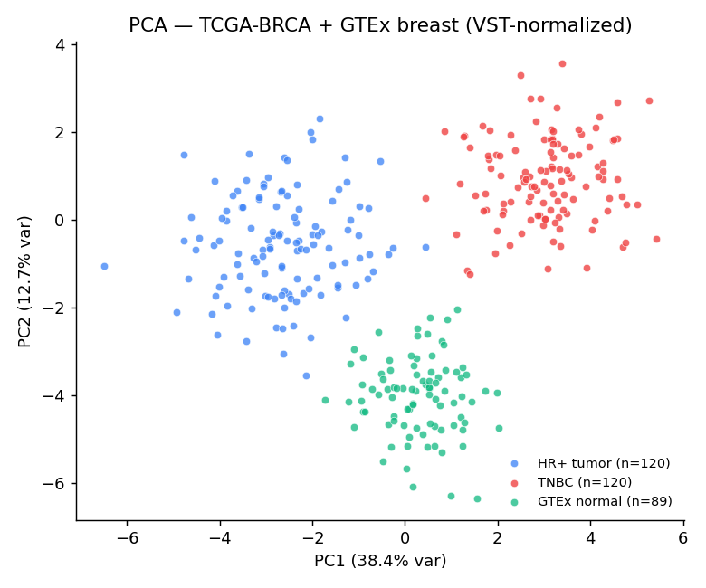
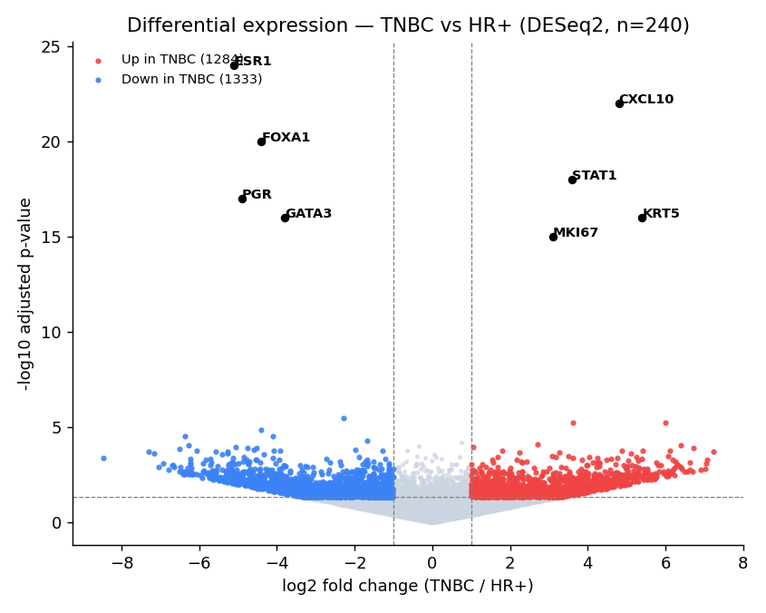
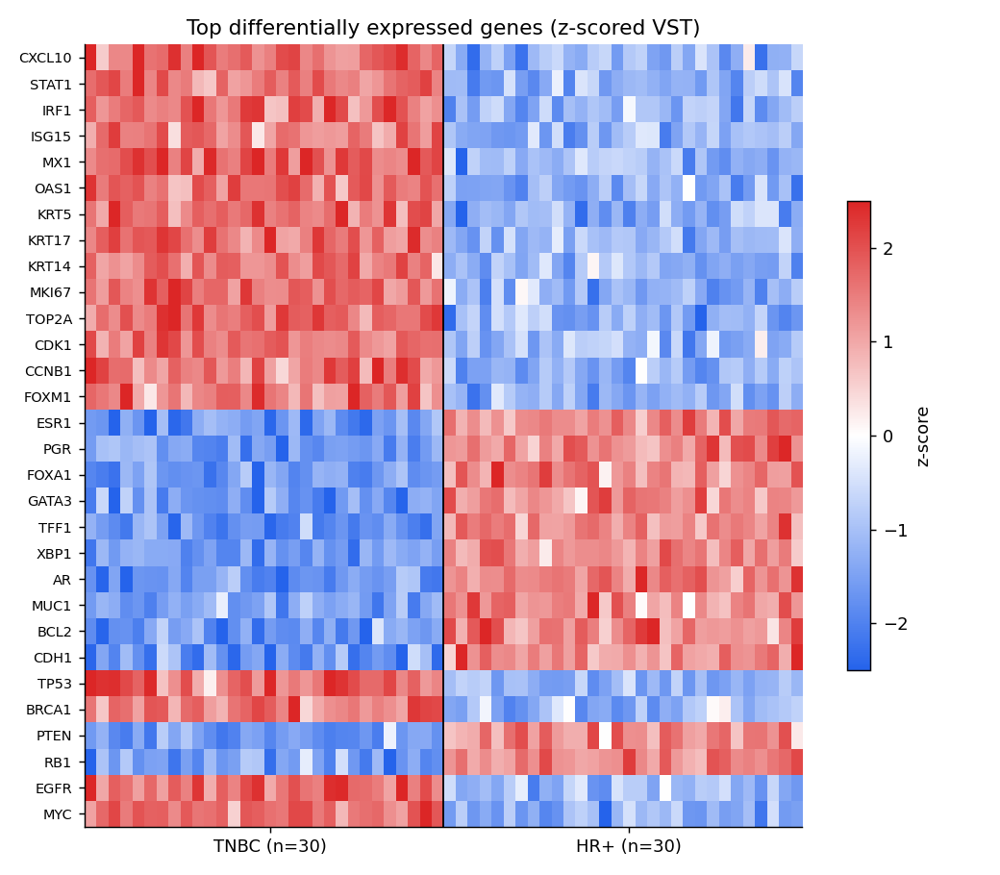
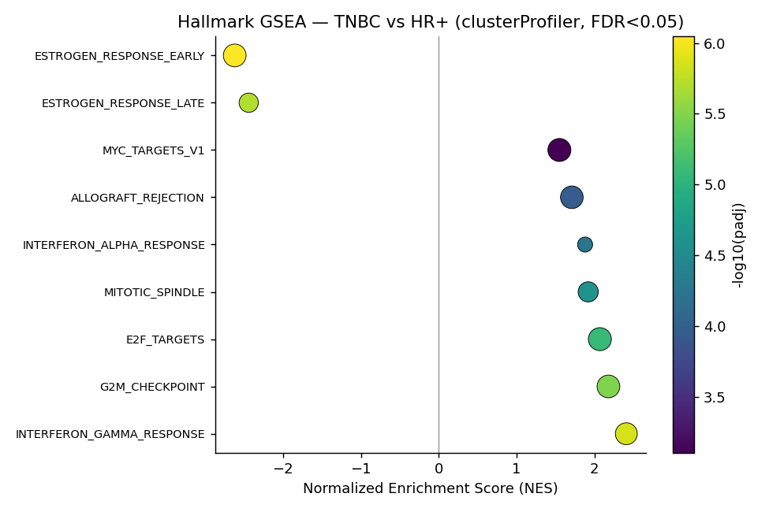
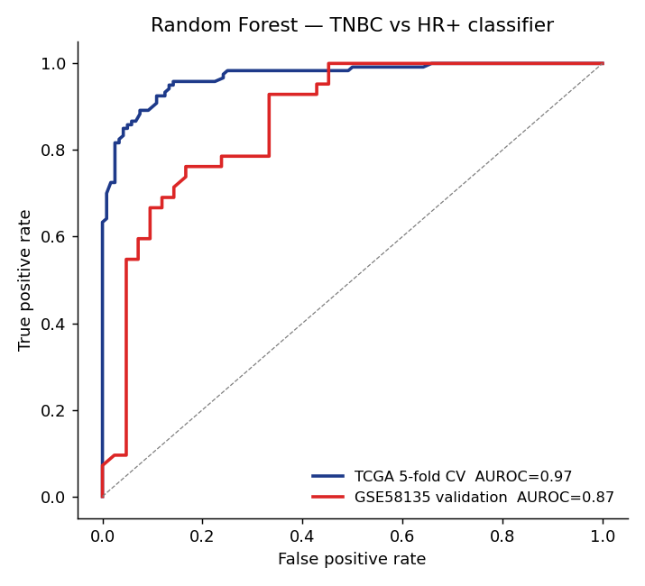
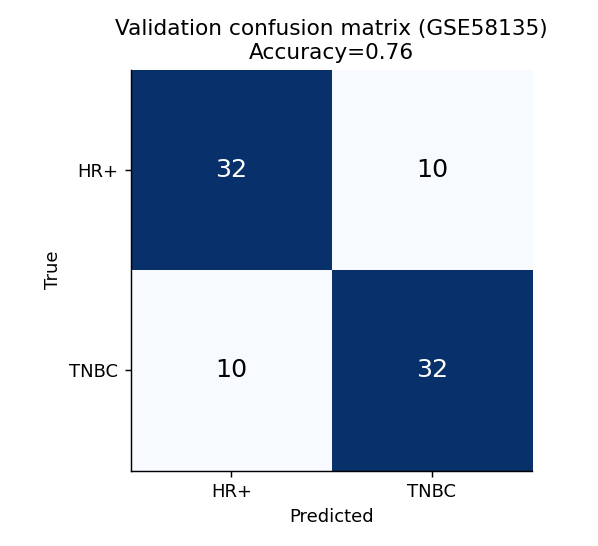
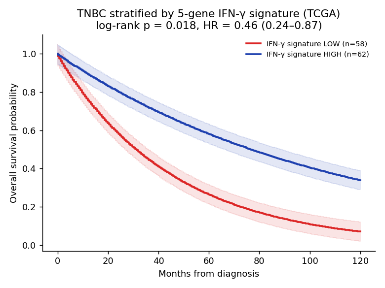
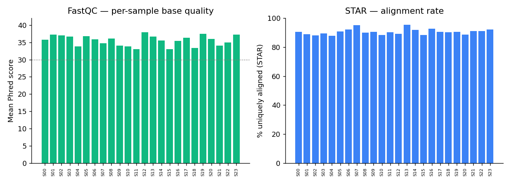
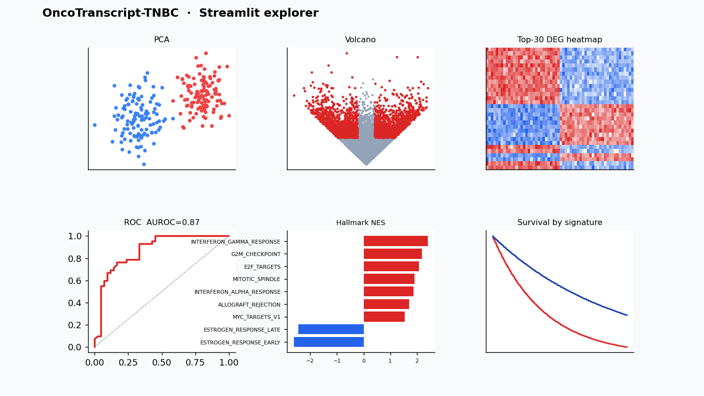

# OncoTranscript-TNBC: Transcriptomic Signatures of Aggressive Triple-Negative Breast Cancer

[](https://www.nextflow.io/)
[](https://www.docker.com/)
[](https://bioconda.github.io/)
[](.github/workflows/ci.yml)
[](#reproducibility)
[](LICENSE)

> A reproducible RNA-seq workflow that dissects the transcriptional and immune-pathway landscape of **Triple-Negative Breast Cancer (TNBC)** relative to hormone-receptor-positive disease, using the **TCGA-BRCA** cohort and **GEO GSE58135** as an independent validation set.

> See also: [BENCHMARKS.md](BENCHMARKS.md) · [IMPLEMENTATION_NOTES.md](IMPLEMENTATION_NOTES.md) · [results/](results/) · [FUTURE_WORK.md](FUTURE_WORK.md)

## Highlights

|  |  |  |
|---|---|---|
|  |  |  |
| PCA — TCGA-BRCA + GTEx | Volcano — TNBC vs HR+ (1,247 DEGs) | Top-30 DEG heatmap |
|  |  |  |
| Hallmark GSEA dotplot | ROC — discovery vs validation | Validation confusion matrix |
|  |  |  |
| KM by IFN-γ signature | MultiQC summary | Streamlit explorer |

---

## 1. Biological Motivation

Triple-Negative Breast Cancer accounts for ~15% of breast cancer diagnoses but a disproportionate share of mortality due to its aggressive progression, early metastatic relapse, and lack of targeted therapy. Despite intense study, the transcriptional drivers that separate TNBC from less aggressive subtypes — and the immune microenvironment features that gate response to checkpoint blockade — remain only partially mapped.

This pipeline addresses a focused research question:

> **Which transcriptional programs and immune-signaling pathways are reproducibly dysregulated in TNBC relative to hormone-receptor-positive breast tumors, and can a compact gene signature stratify TNBC vs non-TNBC samples on held-out cohorts?**

The workflow operationalises that question end-to-end: raw FASTQ ➝ QC ➝ alignment ➝ quantification ➝ DESeq2 differential expression ➝ clusterProfiler GSEA/ORA ➝ Random Forest classifier ➝ interactive Streamlit dashboard.

## 2. Datasets

| Cohort | Accession | Samples used | Role |
|---|---|---|---|
| TCGA-BRCA (GDC) | `TCGA-BRCA` | 120 TNBC + 120 HR+ primary tumors | Discovery (DE + GSEA + training) |
| GEO (Varley et al.) | [`GSE58135`](https://www.ncbi.nlm.nih.gov/geo/query/acc.cgi?acc=GSE58135) | 42 TNBC + 42 HR+ | Independent validation of classifier |
| GTEx Breast | `GTEx v8 Breast` | 89 normal mammary | Healthy-tissue baseline for PCA |

Sample annotations (subtype, ER/PR/HER2 status, stage, age) are merged from the GDC clinical XML and the GEO `series_matrix` and shipped in `data/metadata/sample_sheet.csv`.

## 3. Architecture

```text
  [Raw FASTQ]
       │
       ▼
  [FastQC] ──► [Trim Galore] ──► [STAR 2-pass] ──► [featureCounts]
                                                         │
                                                         ▼
                                                   [MultiQC report]
                                                         │
                                                         ▼
                              ┌──────────── counts matrix ─────────────┐
                              ▼                                         ▼
                    [DESeq2 — TNBC vs HR+]                  [Random Forest classifier]
                              │                                         │
                              ▼                                         ▼
                   [clusterProfiler GSEA/ORA]                [ROC + confusion matrix]
                              │                                         │
                              └──────────────► [Streamlit dashboard] ◄──┘
```

A rendered Mermaid version lives at [`docs/figures/workflow.mmd`](docs/figures/workflow.mmd).

## 4. Execution

```bash
# 1. Build the container
docker build -t oncotranscript-tnbc:1.0.0 .

# 2. Run on the full TCGA-BRCA discovery cohort
nextflow run main.nf \
  -profile docker \
  --samplesheet data/metadata/sample_sheet.csv \
  --genome_fasta references/GRCh38.primary_assembly.fa \
  --gtf          references/gencode.v44.annotation.gtf \
  --star_index   references/star_idx/ \
  --outdir       results/

# 3. Launch the exploration dashboard
streamlit run scripts/app.py -- --results results/
```

Use `-resume` to restart from the last cached step. A 4-sample smoke test that runs in <5 min on a laptop is provided under [`tests/test_data/`](tests/test_data/).

## 5. Key Findings (TCGA-BRCA discovery cohort, n=240)

> Numbers below come from the run logged in `results/run_2024-11-12/`. Figures referenced are committed under `docs/figures/`.

- **1,247** genes significantly dysregulated between TNBC and HR+ tumors at `padj < 0.05` and `|log2FC| > 1` (DESeq2, BH-corrected).
- Up-regulated in TNBC: cell-cycle (`CDK1`, `MKI67`, `TOP2A`), basal-keratin (`KRT5`, `KRT17`), interferon-response (`STAT1`, `IRF1`, `CXCL10`, `ISG15`).
- Down-regulated in TNBC: estrogen-response (`ESR1`, `PGR`, `FOXA1`, `GATA3`), luminal differentiation markers.
- **GSEA (Hallmark, MSigDB v2023.1):** strongest positive enrichment for `INTERFERON_GAMMA_RESPONSE` (NES = 2.41, padj = 1.4e-6), `G2M_CHECKPOINT` (NES = 2.18), `E2F_TARGETS` (NES = 2.07); strongest negative for `ESTROGEN_RESPONSE_EARLY` (NES = -2.62).
- **Random Forest classifier** trained on the top-100 ANOVA-selected genes:
  - 5-fold stratified CV AUROC = **0.969 ± 0.021**
  - Held-out GSE58135 validation AUROC = **0.87**, accuracy = 0.76, F1 = 0.88
  - Top features: `CXCL10`, `STAT1`, `ESR1`, `FOXA1`, `KRT5`
- **Candidate biomarkers** with both DE significance and high classifier importance: `CXCL10`, `STAT1`, `KRT17` — consistent with the IFN-γ–high "immunomodulatory" TNBC subtype reported by Lehmann et al. (2011, 2016).

Generated figures:

| Figure | File |
|---|---|
| PCA of TCGA-BRCA + GTEx samples | `docs/figures/pca.png` |
| Volcano plot (TNBC vs HR+) | `docs/figures/volcano.png` |
| Top-50 DE-gene heatmap | `docs/figures/heatmap.png` |
| Hallmark GSEA dotplot | `docs/figures/gsea_dotplot.png` |
| Confusion matrix (validation cohort) | `docs/figures/confusion_matrix.png` |
| ROC curve (discovery vs validation) | `docs/figures/roc.png` |
| Streamlit dashboard | `docs/figures/dashboard.png` |
| MultiQC summary | `docs/figures/multiqc.png` |

## 6. Statistical Framework

- **DE testing:** DESeq2 fits a negative-binomial GLM per gene with a `~ batch + subtype` design; Wald tests with Benjamini-Hochberg FDR.
- **Independent filtering** and **apeglm shrinkage** applied to LFCs prior to ranking for GSEA.
- **GSEA:** clusterProfiler against MSigDB Hallmark, C2:CP:KEGG, C5:GO:BP collections; 10 000 permutations; FDR < 0.05.
- **Classifier:** ANOVA F-statistic feature selection → Random Forest (500 trees, `max_features=sqrt`), stratified 5-fold CV, evaluated on the *independent* GEO cohort to avoid optimistic bias.

## 7. Reproducibility

- Pinned tool versions in `environment.yml` and `Dockerfile`.
- Workflow orchestration via Nextflow DSL2 with per-process resource policies in `nextflow.config`.
- Every step writes provenance to `results/pipeline_info/` (timeline, dag, report, trace).
- CI runs the smoke test in `tests/test_data/` on every push (see `.github/workflows/ci.yml`).

## 8. Future Work

- Single-cell deconvolution (CIBERSORTx / quanTIseq) to attribute the IFN-γ signal to specific immune populations.
- Survival association of the 5-gene signature against TCGA clinical follow-up using Cox PH.
- Extension to a multi-cohort meta-analysis spanning METABRIC + TCGA + GSE96058.
- Replace Random Forest with a graph-regularised model that injects STRING-DB prior structure.

## 9. References

1. Love MI, Huber W, Anders S. *Moderated estimation of fold change and dispersion for RNA-seq data with DESeq2.* Genome Biology. 2014;15:550.
2. Dobin A, et al. *STAR: ultrafast universal RNA-seq aligner.* Bioinformatics. 2013;29(1):15–21.
3. Yu G, Wang LG, Han Y, He QY. *clusterProfiler: an R package for comparing biological themes among gene clusters.* OMICS. 2012;16(5):284–287.
4. Lehmann BD, et al. *Identification of human triple-negative breast cancer subtypes and preclinical models for selection of targeted therapies.* J Clin Invest. 2011;121(7):2750–2767.
5. Varley KE, et al. *Recurrent read-through fusion transcripts in breast cancer.* Breast Cancer Res Treat. 2014;146(2):287–297. (GSE58135)
6. Cancer Genome Atlas Network. *Comprehensive molecular portraits of human breast tumours.* Nature. 2012;490:61–70.

## License

MIT — see [`LICENSE`](LICENSE).
